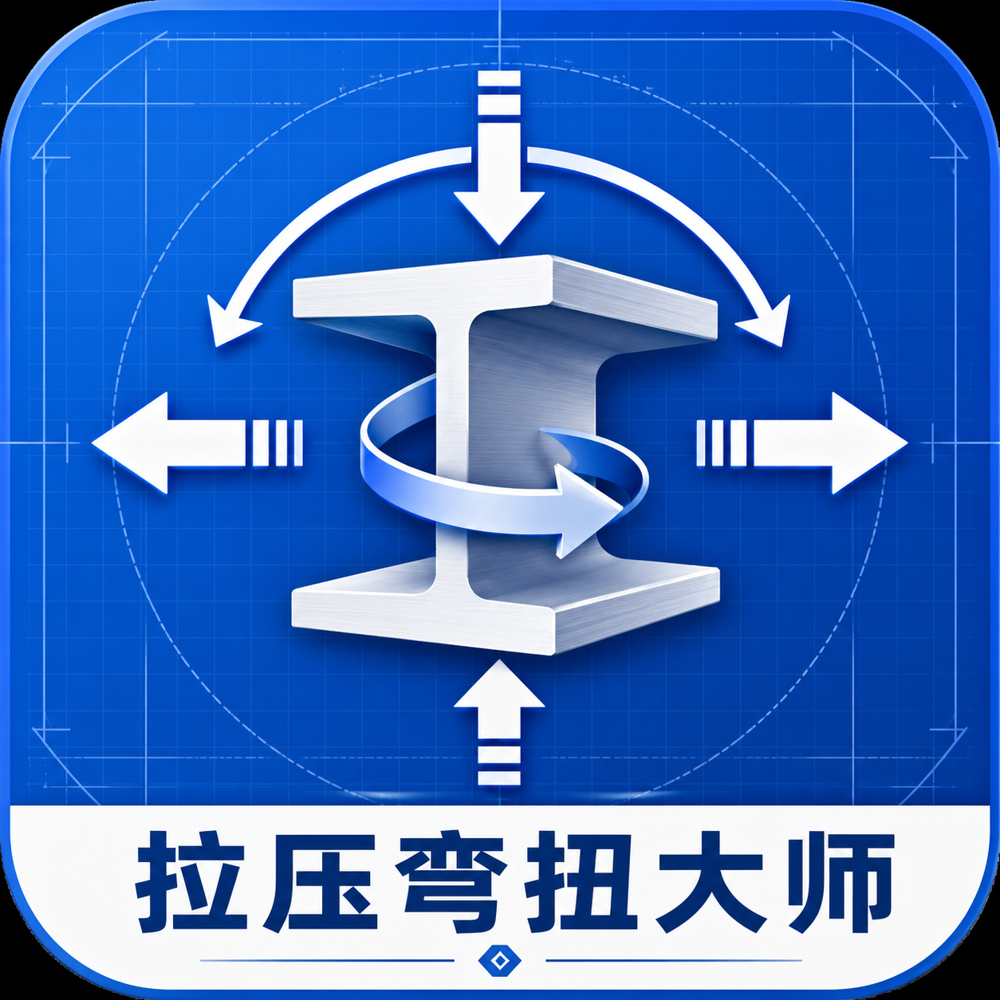

# 拉压弯扭大师



**2.0.0 · 面向材料力学学习的本地离线求解与公式计算软件**

拉压弯扭大师是一款面向材料力学、结构力学基础和杆系分析学习场景的桌面软件。软件围绕“拉伸压缩、弯曲、扭转、组合变形”四类核心问题组织功能，帮助使用者完成建模、求解、推导、危险截面识别和字母公式计算。

本项目直接面向材料力学学习、教学演示和应试训练开发，不是北京航空航天大学官方软件，不得用于实际工程设计、工程鉴定或商业用途。

## 核心功能

- 中文界面：默认使用简体中文界面，保留英文语言包。
- 本地离线运行：桌面版安装后不依赖云端服务器，结构求解、符号表达式和项目文件处理都在用户自己的电脑完成。
- 二维杆系建模：支持节点、梁单元、材料、截面、支座约束、节点荷载、单元荷载、集中力矩、梯形荷载和温度荷载。
- 结果查看：支持支反力、轴力、剪力、弯矩、变形图和单元端力查看。
- 字母计算：支持 `F`、`N`、`V`、`M`、`T`、`E`、`G`、`A`、`I`、`J`、`W`、`Wt`、`L`、`fy` 等常用材料力学字母参与计算。
- 常用公式库：内置轴向应力、弯曲应力、扭转剪应力、von Mises、轴向变形、悬臂梁挠度、简支梁挠度、扭转角、EA、EI、温度应力和安全系数公式。
- 组合变形：支持拉伸/压缩、弯曲、扭转三类作用组合下的应力、变形和安全系数计算。
- 教学助手：提供分步推导、典型题库模板、危险截面识别和三维有限元教学示例。
- 三维线单元求解：空间桁架已形成“建模、校核、本地求解、结果表、三维变形与轴力显示”闭环；空间梁/刚架内核和 sparse LU 后端可用于教学验证。
- 统一二维/三维工作区：分析维度与视图方式相互独立，支持二维、三维和同步分屏显示；切换视图不会重复求解。
- 本地 Worker 求解：空间杆系求解在浏览器 Worker 中执行，界面保持响应；Worker 不可用时会明确提示并回退到本地主线程 CPU。
- 计算设备检测：支持自动、本地 GPU 实验检测和本地 CPU 选择。2.0.0 仅检测 WebGPU 能力，尚未启用 GPU 数值内核，不会虚假显示 GPU 已参与求解。
- 本地安装包：支持生成 Windows 一键安装 `.exe`，也支持 PWA 和离线静态包分发。

## 快速开始

项目需要 Node.js 20 或更高版本。仓库内也可使用 `.local-tools` 中的本地 Node 工具链。

```bash
npm install
npm run dev
```

开发服务默认运行在：

```text
http://localhost:3000
```

## 本地构建

生成生产版本：

```bash
npm run build
```

预览生产版本：

```bash
npm run app:preview
```

浏览器打开：

```text
http://127.0.0.1:4173
```

## 生成 Windows 安装包

推荐使用项目内置 Node 工具链：

```powershell
$env:Path = "$PWD\.local-tools\node-v22.22.2-win-x64;$env:Path"
.\.local-tools\node-v22.22.2-win-x64\npm.cmd run desktop:dist:win
.\.local-tools\node-v22.22.2-win-x64\npm.cmd run release:checksums
```

生成文件：

```text
release/desktop/拉压弯扭大师-<version>-x64-Setup.exe
release/desktop/SHA256SUMS.txt
release/desktop/release-manifest.json
```

校验安装包：

```powershell
powershell -ExecutionPolicy Bypass -File .\release\desktop\verify-installer.ps1 .\release\desktop
Get-FileHash .\release\desktop\拉压弯扭大师-<version>-x64-Setup.exe -Algorithm SHA256
Get-AuthenticodeSignature .\release\desktop\拉压弯扭大师-<version>-x64-Setup.exe
```

没有正式代码签名证书时，安装包可以安装使用，但 Windows 不能证明发布者身份。公开分发前建议配置代码签名证书；没有证书时至少提供 SHA256 哈希，便于识别文件是否被篡改。

## 分享与隐私

推荐通过以下方式分享给其他人：

- GitHub Release：上传 Windows 安装包和 SHA256 校验文件。
- GitHub Pages：发布静态网页版本。
- 离线压缩包：打包 `dist` 与本地启动脚本。

这些方式都不会调用发布者电脑的算力、信息或存储空间。对方运行软件时，计算发生在对方电脑本地，项目文件也保存在对方自己的电脑上。

## 常用命令

```bash
npm run dev              # 启动开发服务
npm run build            # 构建生产版本
npm run app:preview      # 预览生产版本
npm run test:run         # 运行单元测试
npm run typecheck:3d     # 严格检查三维求解核心与统一模型
npm run desktop:dist:win # 生成 Windows 一键安装包
npm run release:checksums # 生成 SHA256 校验文件
```

## 技术栈

- Vue 3
- TypeScript
- Vite
- Vuetify
- Pinia
- vue-i18n
- Electron
- electron-builder
- mathjs
- ts-fem

## 当前开发重点

- 完善拉压弯扭组合变形的教学流程。
- 扩展三维有限元建模交互。
- 引入更高性能的 WASM Cholesky/LDLT 求解器。
- 增加报告导出功能，输出模型图、荷载图、内力图、变形图和关键校核结果。
- 配置正式代码签名证书，降低 Windows 安装警告并增强防篡改能力。

## 许可

本项目保留原仓库许可证。使用、修改和分发前请阅读仓库中的 `LICENSE` 文件。

## 2.0.0 三维有限元进展

当前三维有限元核心已扩展到三类本地求解模块：

- `spaceTruss3D`：三维桁架单元，支持 3 个平动自由度、轴力、应力和安全系数。
- `spaceFrame3D`：三维梁/刚架单元，支持 6 个节点自由度、轴向、双向弯曲、扭转和端部内力。
- `solidTetra3D`：四节点三维实体四面体单元，支持实体位移、常应变、三维应力、von Mises 应力、最大危险单元和最小安全系数识别。

三维模块均在用户本地运行，可选择 `dense`、`sparse-assembly` 或 `sparse-lu` 矩阵后端，不依赖云端服务器。

统一结构工作区当前已开放空间桁架与空间刚架工作流：

1. 定义材料 `E/G`、屈服强度和截面 `A/Iy/Iz/J`。
2. 输入节点真实 `X/Y/Z` 坐标和 `Ux/Uy/Uz/Rx/Ry/Rz` 约束。
3. 连接空间杆件并施加 `Fx/Fy/Fz` 节点荷载。
4. 通过模型检查后在本地 Worker 中执行 sparse LU 求解。
5. 查看节点位移、支座反力、杆件轴力、正应力、安全系数和三维变形。

求解结果绑定模型修订号。几何、材料、截面、约束或载荷改变后，旧结果会标记为过期，不再作为当前模型结果显示。

当前限制：

- 空间桁架只承受轴力，不支持节点力矩、构件分布荷载和弯矩/剪力结果。
- 空间刚架采用 12×12 Euler-Bernoulli 单元，可输入节点力矩并查看轴力、双向剪力、双向弯矩和扭矩结果。
- Tet4 仅为实验性常应变实体内核，尚无网格导入、应力恢复和连续实体云图。
- `sparse-lu` 当前基于 mathjs，不是 WASM Cholesky/LDLT。
- WebGPU 当前只完成本机能力检测，GPU 刚度组装、约束处理和迭代求解内核尚待下一阶段实现。

本轮实现、限制与下一阶段路线见 [2.0.0 第一阶段报告](docs/version-2.0-stage-1.md)。
